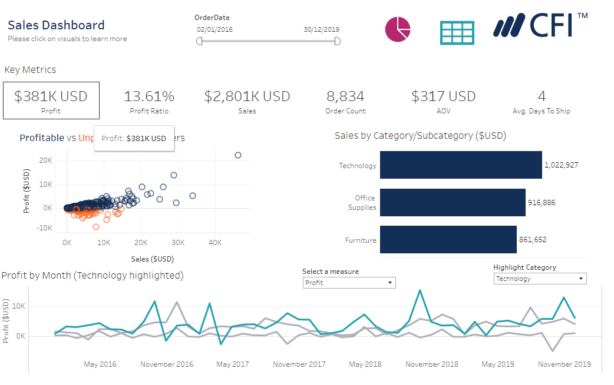

# Analysing-The-office-e-commerce-data
## Case Study Overview

 The data belongs to a fictional e-commerce company called The Office Store. 

 Prouct are grouped into three segments serving the needs of General Consumers,as well as, Corporate and Home offices.
The Company sells a wide variety of products including Office Supplies, Funiture and Technology products.

 
 Products are manufactured in two different countries, the United States and Canada.The company sells exclusively online and has no physical stores,the business ships products to customers in US,seperating the customers into four regions 

 
 ## Tables Used in our case study
 
There are 2 tables in our used case,which are the *Fact Table* & *Dimension Table*

 
 ### Facts Table Includes:
 - Fact Orders Table 
 - Facts Orders 18-19 Tbale
 
 ### Dimension Tables
 - Customer Dimension Table
 - Location Dimension Table
 - Product Dimension Table
 - Shipping Dimension Table
 
 ### Data Modelling
 
 The 2 facts tables are appended together to form a complete table 

 
 The Foreign Key (FK) in the facts table is used to JOIN the the primary key (Pk) in the dimension tables to form an ER Diagram 

 
 ### Data CLeaning & Metrics Building
 
 I did some basic data cleaning in the facts table by splitting the OrderId column and namiing an aliases for one of the splited colimn

##### The following KPIs are built from the Data

 -  Profit Ration
 -  Total Sales
 -  Average Order Value
 ### THE OFFICE STORE -DASHBOARD REQUIREMENTS
 - **SALES DASHBOARD (5 years period)**
 
 
Key QUestions to Answer

 
 1. Topline summmary showing high level numbers(ex.Orders,Sales..etc)
 2. Sales by Product Category & SubCategory
 3. Performance Over Time by Category
 4. Most and least profitable accounts
 5. % of total orders produced 
 6. Shipping preferences by SubCategory
 ##### User Interaction
 7. Select a date range
 
 

### Performance By Location Dashboard (5 year period)

Key QUestions to Answer

1. Map showing performance by region
2. Top 10 states by sales
3. Top 10 selling products
4. Tables showing performance by state
#### User Interaction
5. Slice by segment
6. Select a date range

### Conclusion
